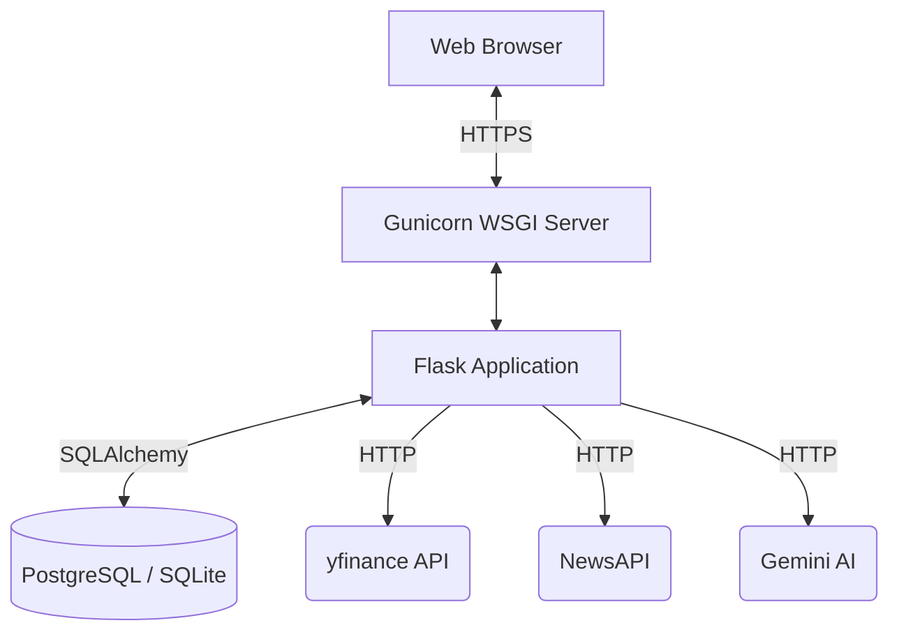
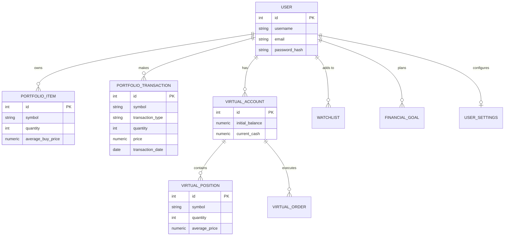
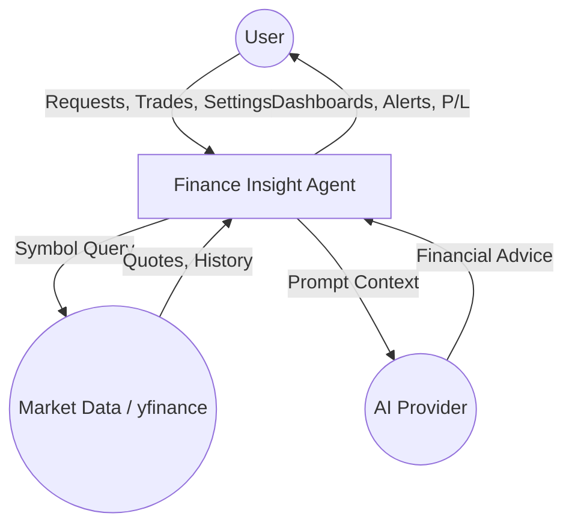
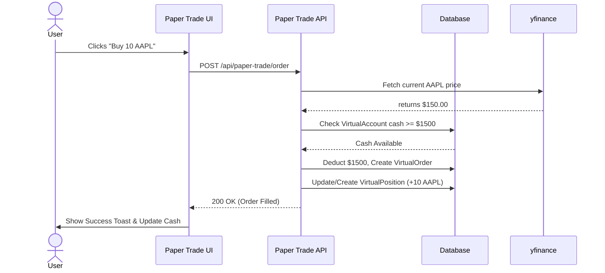
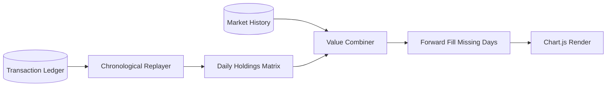
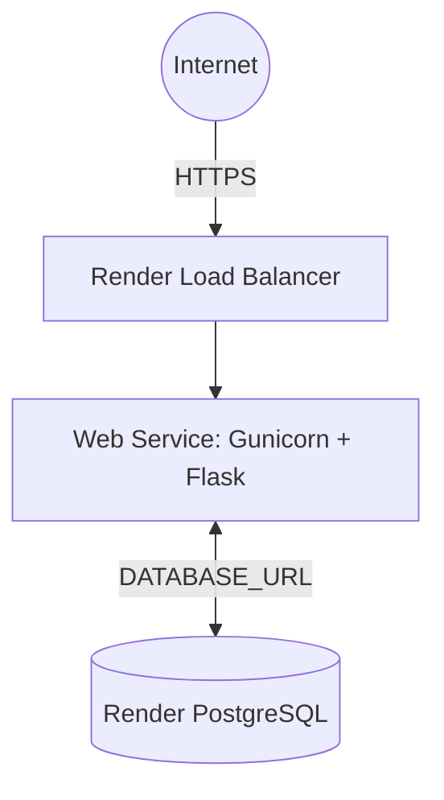

# Finance Insight Agent

A comprehensive, production-ready financial dashboard and intelligence platform. Built with Flask, SQLAlchemy, yfinance, and Gemini AI.

## Objectives
To provide a secure, personalized environment where users can manage their real portfolios, simulate trading via a paper trading engine, track financial goals, screen global stocks, and analyze their portfolio's historical performance. Designed as a BSc Computer Science final-year project, the platform emphasizes clean architecture, offline-capable deterministic testing, and secure data isolation.

## Features & Modules
*   **Authentication & Workspace**: Secure registration, login, and user profile management (preferences, password changes, history).
*   **Market Intelligence**: Live and cached stock search, autocomplete, quotes, charting, and news integration.
*   **Real Portfolio**: Track actual holdings, record BUY/SELL transactions, and calculate real-time P/L.
*   **Paper Trading Simulator**: A completely isolated virtual environment to test trading strategies with simulated cash.
*   **Portfolio Analytics Engine**: Reconstructs historical portfolio value by replaying transaction ledgers against historical market data.
*   **Stock Screener**: Discover and filter Indian and International stocks with a responsive, paginated, and cached UI.
*   **Financial Goals**: Plan and track savings targets with linear completion projections.
*   **AI Agent**: Ask financial questions directly to a Gemini-powered conversational assistant.

## Technologies
*   **Backend**: Python, Flask, Flask-SQLAlchemy, Flask-Migrate, Flask-Login, Flask-WTF.
*   **Database**: SQLite (Development) / PostgreSQL (Production).
*   **Frontend**: HTML5, CSS3, Bootstrap 5, Chart.js.
*   **APIs**: `yfinance` (Market Data), NewsAPI (News), Google Gemini (AI).
*   **Testing & CI**: Pytest, Gunicorn (WSGI).

## Architecture & Diagrams

### 1. System Architecture


### 2. Database Entity-Relationship (ER) Diagram


### 3. Data Flow Diagram (Level 0)


### 4. Paper Trading Sequence Diagram


### 5. Portfolio Analytics Flow


### 6. Deployment Architecture (Render)


## Setup & Local Verification
1. Clone the repository.
2. Create a virtual environment: `python -m venv venv` and activate it.
3. Install dependencies: `pip install -r requirements.txt`
4. Set up `.env` (copy from `.env.example`).
5. Initialize the database:
   ```bash
   flask db upgrade
   ```
6. Run the application: `flask run`

## Testing
Run the comprehensive Pytest suite (requires no active internet connection due to mocking):
```bash
python -m pytest -v
```
*Current test suite counts: 83 tests passing flawlessly with zero regressions.*

## Production Deployment (Render)
This project is configured for automated deployment on Render.com.
1. Connect your GitHub repository to Render.
2. Select **Blueprint** to deploy using the included `render.yaml`, OR manually create a Web Service and a PostgreSQL database.
3. **Required Environment Variables**:
   * `FLASK_ENV=production`
   * `SECRET_KEY` (Strong random string)
   * `DATABASE_URL` (PostgreSQL connection string provided by Render)
   * `NEWS_API_KEY` & `GEMINI_API_KEY` (Your API keys)
4. The build command will automatically install dependencies and run `flask db upgrade`.
5. The start command uses `gunicorn wsgi:app`.

## Known Limitations
* **Background Jobs**: The Stock Screener refresh utilizes an in-memory `threading.Lock()` to prevent duplicate jobs. In a multi-worker production environment (e.g. `gunicorn --workers 4`), this lock is scoped to a single process. Heavy background scraping in scaled distributed environments should be migrated to `Celery` + `Redis`.
* **API Limits**: High traffic will quickly exhaust the free tiers of NewsAPI and Gemini.
