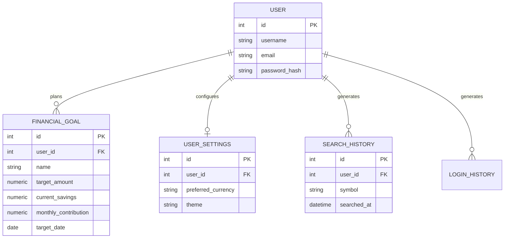

# Phase 5: Financial Goal Planner & User Workspace

## Overview
This phase introduces a robust Financial Goal Planner (Module A) and a User Workspace/Profile (Module B). These modules leverage the existing authentication system to provide personalized financial tracking and secure account management without introducing external dependencies or modifying unrelated modules.

## Module A: Financial Goal Planner
### Models & Schema
*   `FinancialGoal`: Tracks user goals securely via `user_id`.
*   Fields: `id`, `user_id`, `name`, `target_amount`, `current_savings`, `monthly_contribution`, `target_date`, `created_at`, `updated_at`.

### Calculation Formulas
*   **Remaining Amount**: `max(0, target_amount - current_savings)`
*   **Progress Percentage**: `min(100, (current_savings / target_amount) * 100)`
*   **Required Monthly Savings**: `Remaining Amount / Months Left` (Calculated using simple linear division without assuming arbitrary investment returns).
*   **Projected Savings**: `Current Savings + (Planned Monthly Contribution * Months Left)`
*   **Estimated Completion Date**: `Current Date + ceil(Remaining / Planned Monthly)` (Only computed if monthly contribution is > 0).

### API Endpoints
*   `GET /api/workspace/goals`: Lists all user goals.
*   `POST /api/workspace/goals`: Creates a new goal.
*   `PUT /api/workspace/goals/<id>`: Edits a specific goal.
*   `DELETE /api/workspace/goals/<id>`: Deletes a specific goal.

## Module B: User Workspace
### Models & Schema
*   `UserSettings`: Tracks `preferred_currency` and `theme` globally.
*   `SearchHistory` & `LoginHistory`: Reused from the existing data layer.

### Features & Endpoints
*   `GET /api/workspace/settings` | `PUT /api/workspace/settings`: Fetch and save global user preferences.
*   `GET /api/workspace/history/search` | `DELETE /api/workspace/history/search`: Fetch and clear paginated search history.
*   `GET /api/workspace/history/login`: Fetch paginated login history.
*   `POST /api/workspace/security/password`: Securely updates a user's password, strictly requiring the correct current password. Does not expose or return plaintext secrets.

## Security and Limitations
*   **Data Isolation**: Every endpoint filters strictly by `current_user.id`. Users cannot interact with or view another user's goals or history.
*   **Validation**: Dates must be in the future for active goal planning. Numeric values are protected against zeroes or negative boundaries where mathematically invalid (e.g. division by zero).
*   **No Investment Promises**: Goal calculators do not promise investment returns. Projections are purely linear contribution models.

## ER Diagram

