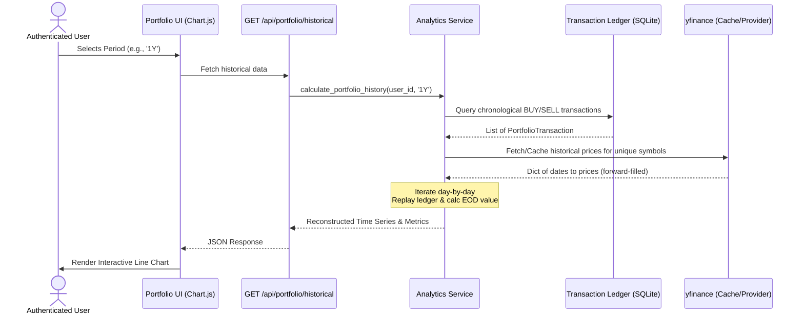

# Phase 3: Advanced Portfolio Analytics Engine

## Overview
This module reconstructs a user's historical portfolio value by replaying their actual recorded `PortfolioTransaction` ledger chronologically against historical daily stock prices. This enables accurate performance metrics (Absolute Return, Percentage Return, Peak Value, Max Drawdown) over configurable time periods without fabricating missing or legacy data.

## Algorithm & Formulas

### 1. Data Retrieval
*   **Transactions**: All BUY/SELL transactions for the user are fetched and ordered chronologically.
*   **Historical Prices**: Real-time missing data is retrieved via `yfinance` from the date of the first transaction to the present day. Data is forward-filled (`method='ffill'`) to seamlessly handle weekends and market holidays. A thread-safe, in-memory TTL dictionary cache prevents rate-limiting.

### 2. Chronological Replay
The engine iterates day-by-day from the first transaction to `today`.
*   **BUY**: 
    *   `Holdings += quantity`
    *   `Invested Capital += quantity * execution_price`
*   **SELL**:
    *   `Ratio = quantity_sold / current_holdings`
    *   `Holdings -= quantity_sold`
    *   `Invested Capital -= (Invested Capital * Ratio)` *(Cost basis is reduced proportionally to the quantity sold)*

### 3. Performance Metrics
For each day in the requested period:
*   `Daily Market Value` = Σ (Current Holdings for Symbol × Daily Adjusted Close Price)
*   **Absolute Return** = `Final Market Value - Final Invested Capital`
*   **Percentage Return** = `(Absolute Return / Final Invested Capital) * 100` *(Zero division safe)*
*   **Peak Value** = Maximum recorded End-Of-Day market value during the period.
*   **Max Drawdown** = Maximum `(Peak - Current) / Peak` drop within the period.

## Assumptions & Limitations
*   **Exclusions**: Holdings without explicit recorded `BUY` transactions are mathematically excluded from the reconstructed history to prevent assigning fabricated historical performance to legacy entries.
*   **Taxes/Fees**: Returns are gross estimates and exclude external brokerage fees, taxes, or dividends (unless naturally reflected in adjusted close prices).
*   **Price Fallbacks**: If a symbol is delisted or missing on a specific day, the engine safely falls back to the most recently available known closing price.
*   **Simplicity vs. TWR/MWR**: The percentage return calculation is a simple return against the adjusted cost basis. It does not implement complex Time-Weighted Return (TWR) or Money-Weighted Return (MWR) for extensive external cash flow adjustments.

## API Endpoint
`GET /api/portfolio/historical?period={1M, 3M, 6M, 1Y, ALL}`
*   **Auth**: Requires strict active user session.
*   **Response**: JSON containing `labels` (dates), `market_values` (array), `invested_capital` (array), and `metrics` (object).

## Relevant Files
*   `app/services/portfolio_analytics_service.py` (Core Engine)
*   `app/api/finance.py` (Endpoint Registration)
*   `app/templates/portfolio.html` (Frontend UI & Chart.js rendering)
*   `tests/test_portfolio_analytics_pytest.py` (Deterministic test suite)

## Sequence Diagram

