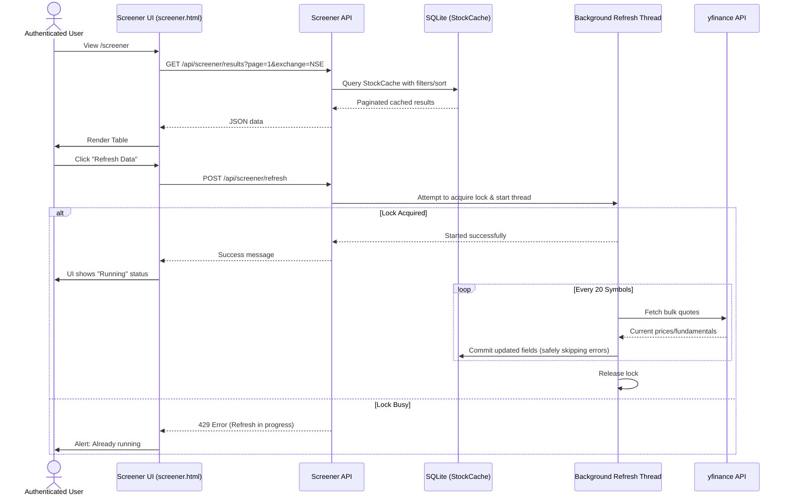

# Phase 4: Stock Screener

## Overview
The Stock Screener allows authenticated users to discover, filter, and sort stocks across Indian (NSE) and international markets. It uses a robust caching layer backed by a dedicated SQLite table to provide instant pagination and sorting without fetching live data for hundreds of stocks on every page load.

## Architecture and Cache Refresh Flow
*   **Database Cache**: The `StockCache` model stores symbols, company names, exchanges, sectors, and key fundamentals (price, market cap, P/E ratio, volume).
*   **Seeding**: A documented starter universe of ~100 top US and ~50 top NSE stocks is automatically seeded if the cache is empty.
*   **Background Refresh**: When a user clicks "Refresh Data" on the frontend, an authenticated `POST /api/screener/refresh` request is triggered. 
    *   This spawns a bounded background daemon thread holding the Flask application context.
    *   A thread lock (`threading.Lock`) prevents multiple refresh tasks from running simultaneously, ensuring deployment safety and avoiding duplicate DB transactions.
    *   The service batches queries to `yfinance.Tickers` in small chunks (20 symbols per batch) to respect API rate limits and avoid network timeouts.
    *   Failing symbols or missing data points do not overwrite or destroy previously valid cached data for that symbol.

## Supported Filters and Sorting
*   **Filters**:
    *   Exchange (NSE, US)
    *   Sector (Dynamically populated based on available data)
    *   Min/Max Price
    *   Min/Max Market Cap (Millions)
    *   Search by Symbol or Company Name
*   **Sorting**:
    *   Price, Market Cap, P/E Ratio, Volume, Symbol (Ascending/Descending)
*   **Pagination**:
    *   Server-side limit of 20 results per page, capped at 100 max per page to prevent SQL denial-of-service.

## Cache Expiry and Stale Data
*   The data is not hard-expired. The `last_updated` timestamp reflects the last successful fetch. 
*   If `yfinance` blocks requests or network connectivity drops, the screener continues to function flawlessly using the last known stale data, heavily preferring system stability over live data strictness.

## API Routes & Database
*   **`GET /api/screener/results`**: Authenticated read-only endpoint returning filtered/sorted JSON data.
*   **`POST /api/screener/refresh`**: Authenticated trigger for the background update thread.
*   **DB Model**: `StockCache` was added via a safe Alembic migration (`flask db migrate`). No existing tables were dropped or altered.

## Known Limitations
*   The daemon-thread architecture is suitable for single-process deployments (like `flask run` or simple gunicorn setups). In a multi-server distributed production environment, this should ideally be migrated to a `Celery` task queue with a Redis-backed distributed lock instead of `threading.Lock`.
*   Data depends on Yahoo Finance (`yfinance`). Fundamental metrics like P/E and Market Cap may occasionally be delayed or absent for certain foreign tickers.

## Architecture Diagram

